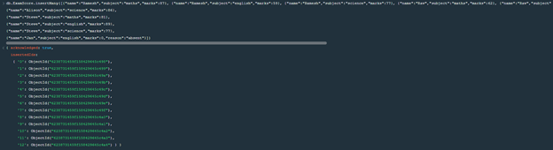
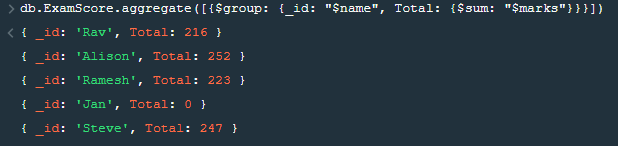
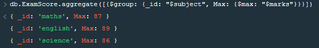
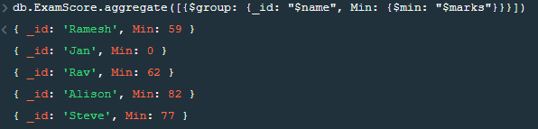
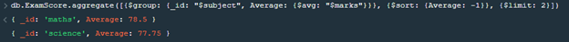

## Question 1
I recommend using relational model because the data have specific size of 1 team and data structure won’t change frequently

## Question 2
I recommend using MongoDB because I think we work on data that unstructured or semi-structured data that doesn’t fit the relational model and require the flexibility of a dynamic schema or want more choice over the data model.

## Question 3
I recommend using MongoDB because for what question give, they didn’t specify structure, so we require the flexibility of a dynamic schema or want more choice over the data model

## Question 4 (Gaming)
```
Game
  {
    team: {
            team1: {
                    name: string,
                    member: {
                              member1_name: string,
                              member2_name: string,
                              ……
                            },
                    score: int
                    },
            team2: {
                    name: string,
                    member: {
                              member1_name: string,
                              member2_name: string,
                              ……
                             },
                    score: int
                    },
            …….
            },
    map: string,
    mode: string
  }
```
```
Player
  {
    Id: int,
    level: int
    name: string,
    clan: string,
    k/da: float,
    money: int,
  }
```

## Question 5

###  Create MongoDB database with following information
```sql
db.ExamScore.insertMany([{"name":"Ramesh","subject":"maths","marks":87}, 
{"name":"Ramesh","subject":"english","marks":59}, 
{"name":"Ramesh","subject":"science","marks":77}, 
{"name":"Rav","subject":"maths","marks":62}, 
{"name":"Rav","subject":"english","marks":83},
{"name":"Rav","subject":"science","marks":71}, 
{"name":"Alison","subject":"maths","marks":84}, 
{"name":"Alison","subject":"english","marks":82},
{"name":"Alison","subject":"science","marks":86},
{"name":"Steve","subject":"maths","marks":81},
{"name":"Steve","subject":"english","marks":89},
{"name":"Steve","subject":"science","marks":77},
{"name":"Jan","subject":"english","marks":0,"reason":"absent"}])
```


### Find the total marks for each student across all subjects
```sql
db.ExamScore.aggregate([{$group: {_id: "$name", Total: {$sum: "$marks"}}}])
```


### Find the maximum marks scored in each subject
```sql
db.ExamScore.aggregate([{$group: {_id: "$subject", Max: {$max: "$marks"}}}])
```


### Find the minimum marks scored by each student
```sql
db.ExamScore.aggregate([{$group: {_id: "$name", Min: {$min: "$marks"}}}])
```


### Find the top two subjects based on average mark
```sql
db.ExamScore.aggregate([{$group: {_id: "$subject", Average: {$avg: "$marks"}}}, {$sort: {Average: -1}}, {$limit: 2}])
```

